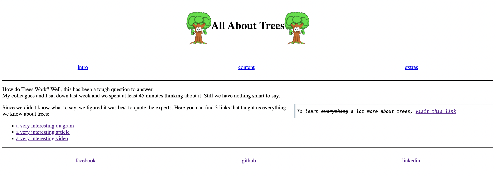

# All About Trees

> Our project about making a comfortable and helpful place which will give our
> users an information about environment issues and possible solutions

## Table of contents

- [Name of project](#all-about-trees)
  - [Table of contents](#table-of-contents)
  - [General info](#general-info)
  - [Screenshots](#screenshots)
  - [Technologies](#technologies)
  - [Setup](#setup)
  - [Code Examples](#code-examples)
  - [Status](#status)
  - [Contact](#contact)

## General info

> Our website helps to navigate our guests to precise and detailed information about trees, their description, and helps to raise awareness, and it provides the best solutions to protect them.

## Screenshot



## Technologies

- Node v18.15.0
- VSC code
- HTML
- CSS

## Setup

- `git clone https://github.com/BF-FrontEnd-class-2025/group-1-all-about-trees.git`
- `npm install`

## Code Examples

```html
<!DOCTYPE html>
<html lang="en">
    <head>
        <meta charset="utf-8" />
        <title>All About Trees</title>
```

## Status

Project is: _completed_

## Contact

By

- [A-SHA256](https://github.com/A-SHA256)
- [Susana](https://github.com/SusanaLoaiza)
- [Mohamed](https://github.com/SMElbanna200)
- [Anton](https://github.com/antonaksyuk)
